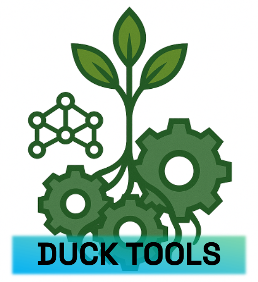
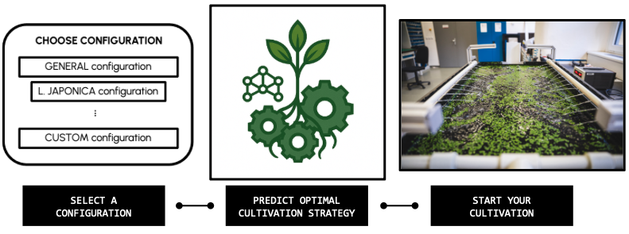
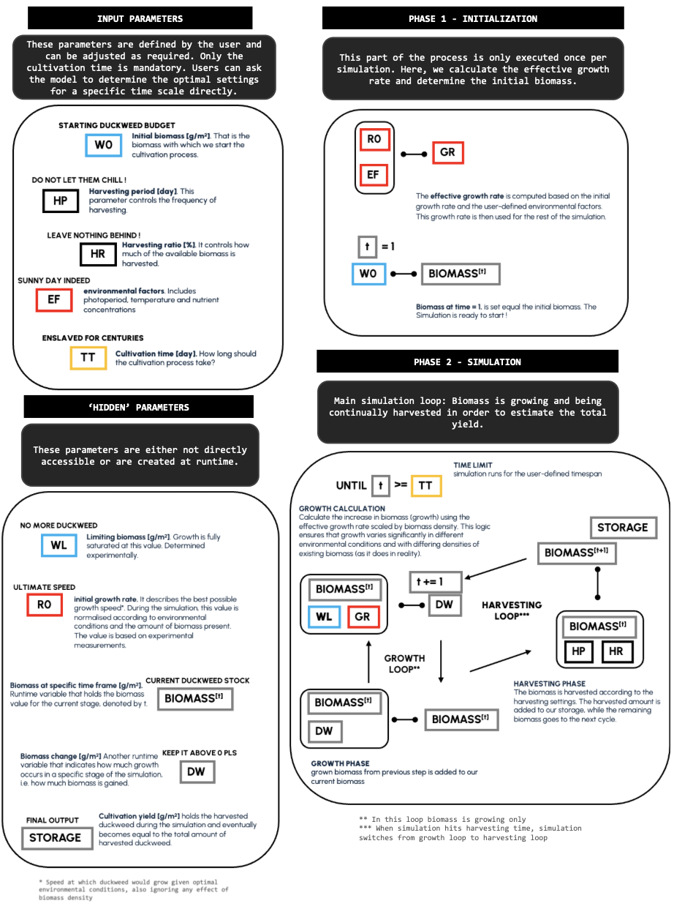
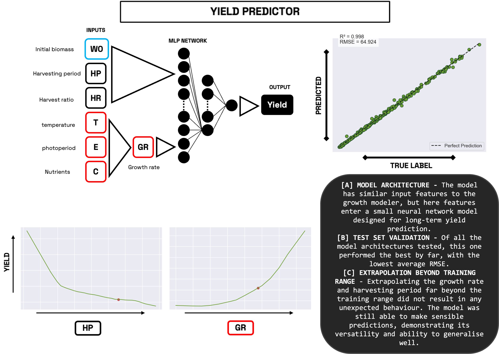
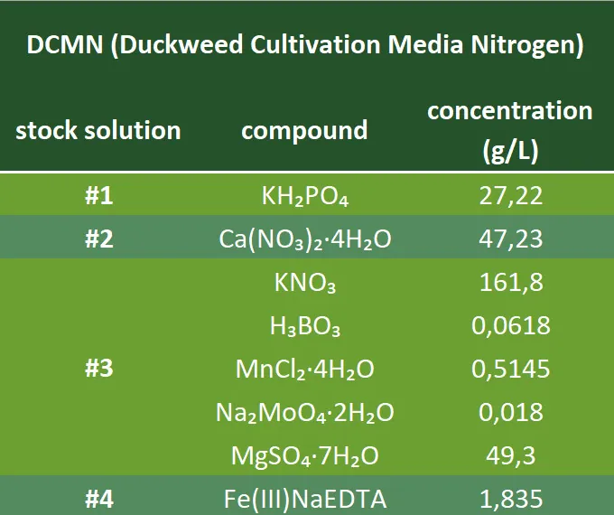

# DUCKTOOLS

## Overview

<p align="center">
  
</p>

**DUCKTOOLS** is a versatile toolbox for in-silico cultivation of duckweed plants, developed by the [iGEM BRNO team](https://teams.igem.org/5642) for the [iGEM competition](https://competition.igem.org).



This toolbox enables rapid and cost-effective design of duckweed cultivation, scalable from small laboratory experiments to large industrial setups. Users can select predefined configurations (including a general-purpose option) or customize the toolbox for specific duckweed varieties, other plants, or unique environmental conditions.

## Features
DUCKTOOLS provides a user-friendly workflow to design efficient cultivation strategies:

1. **Select a Configuration File**  
   Choose a configuration file defining growth parameters for specific duckweed species. Predefined options include a general-purpose configuration for a wide range of duckweed plants. See the [Configuration Section](#configuration) for details.

2. **Choose a Simulator Model**  
   Run in-silico simulations to estimate cultivation yields based on the selected configuration. Outputs include:
   - A heatmap visualizing estimated yields for various parameter sets.
   - A table of optimal cultivation parameters.

3. **Optimal Cultivation Parameters**  
   - **Harvesting Period (days)**: Frequency of harvesting.
   - **Harvesting Ratio (%)**: Percentage of biomass to harvest.
   - **Initial Biomass (g/m²)**: Starting biomass per cultivation tray.

4. **Start Real-Life Cultivation**  
   Use the predicted parameters to begin efficient and sustainable cultivation.

---

## Installation

### Local Installation
To set up DUCKTOOLS locally, follow these steps:

1. **Clone the Repository**  
   ```bash
   git clone https://github.com/karatedava/DUCKTOOLS.git
   cd DUCKTOOLS
   ```

2. **Install Miniconda**  
   Download and install Miniconda by following the [official Miniconda installation guide](https://www.anaconda.com/docs/getting-started/miniconda/install#quickstart-install-instructions).

3. **Create a Conda Environment**  
   Create and activate a Python 3.12 environment:
   ```bash
   conda create -n ducktools python=3.12
   conda activate ducktools
   ```

4. **Install Dependencies**  
   Install the required packages:
   ```bash
   pip install -r requirements.txt
   ```

### Web Application
No installation required! Access 'DUCKTOOLS' full functionality via our mobile-optimized web application:  
👉 **[Web App](https://malleably-unhabituated-kristin.ngrok-free.dev)**

---

## Running DUCKTOOLS (Local Installation)

1. **Run the Simulation**  
   Navigate to the project directory and execute:
   ```bash
   python run_simulation.py --time 100
   ```

2. **View Results**  
   Outputs are saved in the `data` directory, including:
   - A table of optimal cultivation parameters.
   - Visualizations (e.g., heatmaps).
   - Raw `.csv` files for custom analysis.

### Command-Line Parameters
Customize simulations with these parameters:

| Parameter       | Description                                              | Options/Default                     |
|-----------------|----------------------------------------------------------|-------------------------------------|
| `--simulator`   | Computational model for in-silico calculations           | `GM` (default), `YP` (Yield Predictor) |
| `--time`        | Cultivation time (days, used for GM only)                | `100` (default)                     |
| `--config`      | Path to configuration file                               | `config_safe` (default)             |
| `--lb`          | Limiting biomass (g/m²)                                  | `1300` (default, experimentally measured) |
| `--report`      | Generate a graphical report                              | `True` (default)                    |
| `--output_dir`  | Output directory for results                             | `data` (default)                    |
| `--maxbudget`  | your maximum duckweed budget with which you can initiate cultivation (g/m²), it is recommended to stay in the range of <200 - 1000>                  | `600` (default)                    |

**Example Command:**
```bash
python run_simulation.py --simulator GM --time 30 --config config_japonica --lb 1000
```

---

## Configuration
Configuration files are JSON files defining growth parameters:

- **initial_growth_rate**: Intrinsic growth rate, independent of biomass.
- **growth_constant**: Species-specific scaling of growth rate.
- **integration_step**: Frequency of biomass growth recalculation (used in GM simulator).

**Note**: Configuration files are based on experimental data and should not be edited directly. To create custom configurations, refer to the [Optimization Section](#optimization).

### Available Configurations
- **safe**: Default, optimized for a wide range of duckweed species.
- **japonica**: Fine-tuned for *Lemna japonica*.
- **minor**: Fine-tuned for *Lemna minor*.
- **superfast**: Optimized for fast-growing duckweed in controlled environments with [optimal conditions](#cultivation-conditions).

---

## Simulators
DUCKTOOLS includes two independent simulator models for in-silico cultivation:

### Growth Modeler (GM)
  
A mathematical model simulating duckweed growth based on configuration parameters.

### Yield Predictor (YP)
  
A machine learning-based predictor for estimating cultivation yields.

---

## Cultivation Conditions
For optimal results, maintain these environmental conditions:
- **Temperature**: 23–28°C
- **Photoperiod**: 16-hour light / 8-hour dark cycle
- **Light Intensity**: ~200 µmol/m²/s

### Medium Composition


---

## Optimization

To tailor the model to your specific setup (e.g., environmental conditions, growth medium, or duckweed species), you can generate a custom configuration based on your harvesting experiments.

### Preparing Your Data
In the `optimization_data` folder, you'll find a template JSON file that outlines how to structure your data for model tuning. Each "run" in the JSON corresponds to a single harvesting experiment, with the following key fields:
- **hp**: Harvesting period (time between harvests).
- **hr**: Harvesting ratio (proportion of biomass removed).
- **data**: Measured biomass left in the cultivation tray after each harvest. The first value should represent the initial biomass at the start of cultivation.

**Note**: The number of runs is flexible. You can use a single run, but including multiple runs with diverse `hp` and `hr` values will improve the model's precision.

### Running the Optimization
Once your JSON file is ready:
1. Place it in the `optimization_data` directory.
2. Run the following command to generate your custom configuration:

```bash
python run_optimization.py --optimfile yourfile.json --configname configname.json --lb limiting_biomass (optional)

---

## Future Plans
*Work in progress!*  
Add scaling via environmental factors
- this will allow to design effective cultivation even if optimal conditions are (for some valid reason) not reachable
- this will include controls over temperature, photoperiod and some nutrients in medium

---

## License
This project is licensed under the [MIT License](LICENSE).

## Contact
For questions or support, contact the [iGEM BRNO team](https://teams.igem.org/5642) or open an issue on this repository.