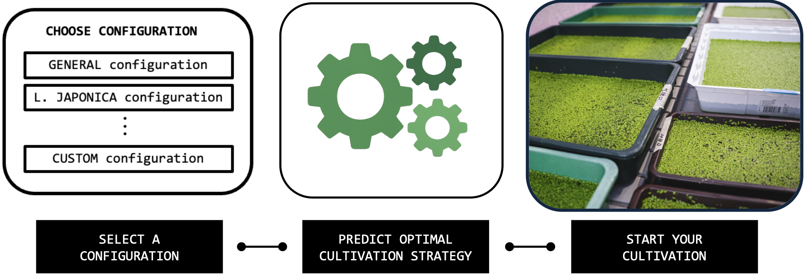
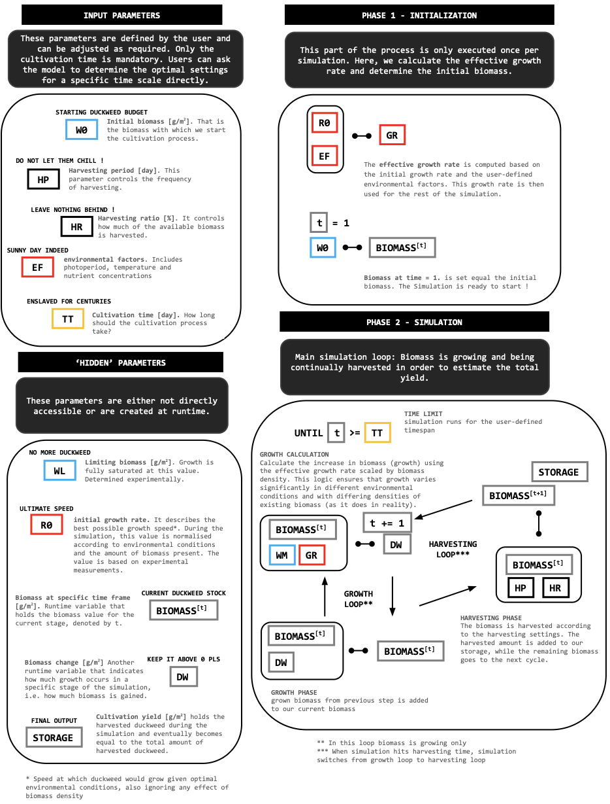
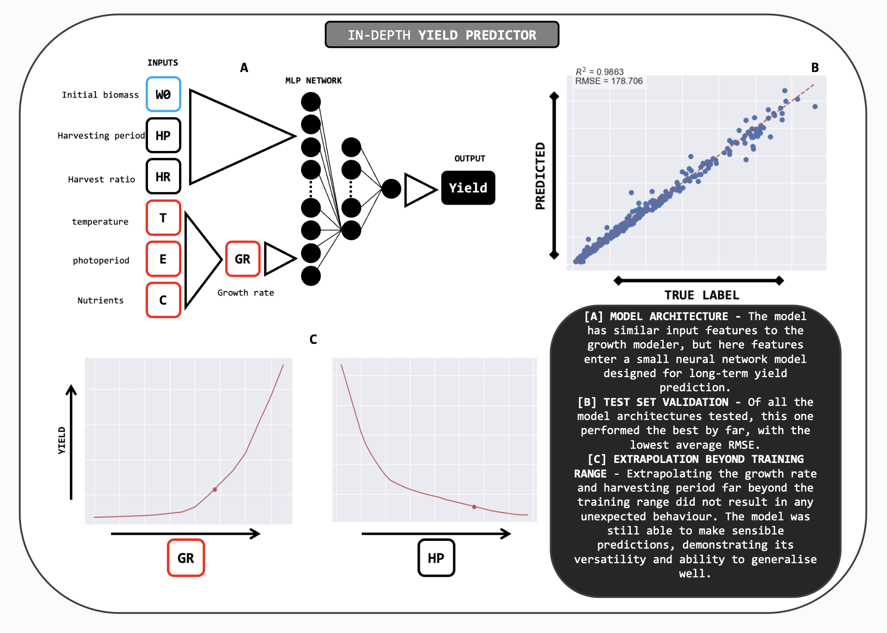

# DUCKTOOLS

## Overview
**DUCKTOOLS** is a toolbox for in-silico cultivation of duckweed plants, developed by the [iGEM BRNO team](https://teams.igem.org/5642) for the [iGEM competition](https://competition.igem.org).

This toolbox enables quick and cost-effective design of duckweed cultivation at any scale, from small laboratory experiments to large-scale industrial production. Users can choose from provided configurations (including a general-purpose one) or customize the toolbox for specific duckweed varieties or other plants and environmental conditions.

## How It Works
The DUCKTOOLS workflow is simple and user-friendly, guiding users through the process of designing an effective cultivation strategy:

1. **Select a Configuration File**
   - The configuration file defines:
     - Growth rate
     - Environmental conditions
     - Expected cultivation duration
   - Predefined configurations are provided, including a general-purpose configuration suitable for a wide range of duckweed plants. More details are available in the [Configuration Section](#configuration).

2. **Choose a Simulator Model**
   - The simulator performs an in-silico simulation to estimate the total yield of a cultivation run based on the selected configuration.
   - Outputs include:
     - A heatmap visualizing estimated yields for various cultivation parameter sets.
     - A table listing multiple sets of optimal cultivation parameters.

3. **Optimal Cultivation Parameters**
   - **Harvesting Period (days)**: Frequency of harvesting.
   - **Harvesting Ratio (%)**: Percentage of biomass to harvest.
   - **Initial Biomass (g/m²)**: Starting biomass per cultivation tray.

4. **Start Real-Life Cultivation**
   - With the configuration and predicted cultivation parameters in place, users are ready to begin efficient and sustainable cultivation.

## Instalation
TODO description

## How to run
TODO description

## Configuration

The configuration file is a critical component of DUCKTOOLS. It is a simple JSON file with the following parameters:

- **cultivation_time**: Duration of the cultivation run.
- **limiting_biomass**: Biomass level at which growth is fully saturated.
- **initial_growth_rate**: Intrinsic growth rate, independent of formed biomass.
- **environmental_constants**: Parameters for growth rate normalization based on environmental conditions (e.g., temperature, light, nutrients).
- **integration_step**: Frequency of biomass growth recalculation (used only in the GM simulator).

**Important**: Configuration files are constructed based on experimental measurements and except CULTIVATION TIME, should not be directly edited. To create a custom configuration, refer to the [Optimization Section](#optimization).

### Available configurations
- **default**: TODO description
- **japonica**: TODO description
- **wolfia**: TODO description

## Simulators

The simulator is the component, which runs the in-silico simulations. Currently we have two independet (based on completely different data) and strucuturally different (mathematical model and AI predictor) simulator models.

### Growth Modeler

TODO description

### Yield Predictor

TODO description

## Optimization
TODO description