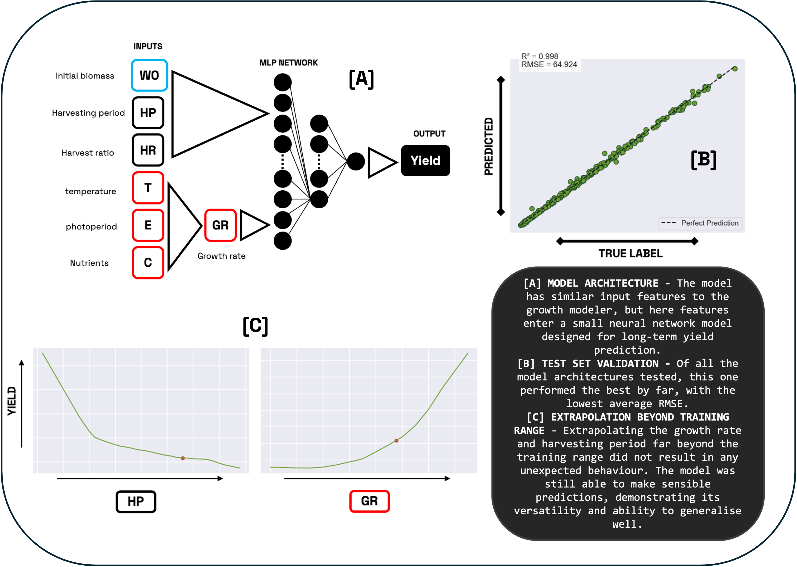

# DUCKTOOLS
<p align="center">
  
</p>

## Overview

**DUCKTOOLS** is a versatile toolbox for in-silico cultivation of duckweed plants, developed by the [iGEM BRNO team](https://2025.igem.wiki/brno-czech-republic/) for the [iGEM competition](https://competition.igem.org). Check out also our toolbox for [CULTIVATION MONITORING](https://github.com/karatedava/DUCKEYE)


This toolbox enables rapid and cost-effective design of duckweed cultivation, scalable from small laboratory experiments to large industrial setups. Users can select predefined configurations (including a general-purpose option) or customize the toolbox for specific duckweed varieties, other plants, or unique environmental conditions.

## Features
DUCKTOOLS provides a user-friendly workflow to design efficient cultivation strategies:

1. **Select a Configuration File**  
   Choose a configuration file defining growth parameters for specific duckweed species. Predefined options include a general-purpose configuration for a wide range of duckweed plants. See the [Configuration Section](#configuration) for details.

2. **Choose a Simulator Model**  
   Run in-silico simulations to estimate cultivation yields based on the selected configuration. Outputs include:
   - A heatmap visualizing estimated yields for various parameter sets.
   - A table of optimal cultivation parameters.

3. **Optimal Cultivation Parameters**  
   - **Harvesting Period (days)**: Frequency of harvesting.
   - **Harvesting Ratio (%)**: Percentage of biomass to harvest.
   - **Initial Biomass (g/m²)**: Starting biomass per cultivation tray.

4. **Start Real-Life Cultivation**  
   Use the predicted parameters to begin efficient and sustainable cultivation.

---

## Installation

### Local Installation
To set up DUCKTOOLS locally, follow these steps:

1. **Clone the Repository**  
   ```bash
   git clone https://github.com/karatedava/DUCKTOOLS.git
   cd DUCKTOOLS
   ```

2. **Install Miniconda**  
   Download and install Miniconda by following the [official Miniconda installation guide](https://www.anaconda.com/docs/getting-started/miniconda/install#quickstart-install-instructions).

3. **Create a Conda Environment**  
   Create and activate a Python 3.12 environment:
   ```bash
   conda create -n ducktools python=3.12
   conda activate ducktools
   ```

4. **Install Dependencies**  
   Install the required packages:
   ```bash
   pip install -r requirements.txt
   ```

### Web Application
No installation required! Access DUCKTOOLS' full functionality via our mobile-optimized web application with camera support:  
👉 **[Web App](https://malleably-unhabituated-kristin.ngrok-free.dev)**

---

## Running DUCKTOOLS (Local Installation)

1. **Run the Simulation**  
   Navigate to the project directory and execute:
   ```bash
   python run_simulation.py --time 100
   ```

2. **View Results**  
   Outputs are saved in the `data` directory, including:
   - A table of optimal cultivation parameters.
   - Visualizations (e.g., heatmaps).
   - Raw `.csv` files for custom analysis.

### Command-Line Parameters
Customize simulations with these parameters:

| Parameter       | Description                                              | Options/Default                     |
|-----------------|----------------------------------------------------------|-------------------------------------|
| `--simulator`   | Computational model for in-silico calculations           | `GM` (default), `YP` (Yield Predictor) |
| `--time`        | Cultivation time (days, used for GM only)                | `100` (default)                     |
| `--config`      | Path to configuration file                               | `config_safe` (default)             |
| `--lb`          | Limiting biomass (g/m²)                                  | `1300` (default, experimentally measured) |
| `--report`      | Generate a graphical report                              | `True` (default)                    |
| `--output_dir`  | Output directory for results                             | `data` (default)                    |

**Example Command:**
```bash
python run_simulation.py --simulator GM --time 30 --config config_japonica --lb 1000
```

---

## Configuration
Configuration files are JSON files defining growth parameters:

- **initial_growth_rate**: Intrinsic growth rate, independent of biomass.
- **growth_constant**: Species-specific scaling of growth rate.
- **integration_step**: Frequency of biomass growth recalculation (used in GM simulator).

**Note**: Configuration files are based on experimental data and should not be edited directly. To create custom configurations, refer to the [Optimization Section](#optimization).

### Available Configurations
- **safe**: Default, optimized for a wide range of duckweed species.
- **japonica**: Fine-tuned for *Lemna japonica*.
- **minor**: Fine-tuned for *Lemna minor*.
- **superfast**: Optimized for fast-growing duckweed in controlled environments with [optimal conditions](#cultivation-conditions).

---

## Simulators
DUCKTOOLS includes two independent simulator models for in-silico cultivation:

### Growth Modeler (GM)
  
A mathematical model simulating duckweed growth based on configuration parameters.

### Yield Predictor (YP)
  
A machine learning-based predictor for estimating cultivation yields.

---

## Cultivation Conditions
For optimal results, maintain these environmental conditions:
- **Temperature**: 21–25°C
- **Photoperiod**: 16-hour light / 8-hour dark cycle
- **Light Intensity**: ~200 µmol/m²/s

### Medium Composition


---

## Optimization
*Work in progress!*  
Details on creating custom configurations will be added soon.

---

## Hardware cultivation setup
Take a look at our professional yet accessible cultivation setup [HERE](https://2025.igem.wiki/brno-czech-republic/hardware)

## License
This project is licensed under the [MIT License](LICENSE).

## Contact
For questions or support, contact the [iGEM BRNO team](https://2025.igem.wiki/brno-czech-republic/) or open an issue on this repository.
